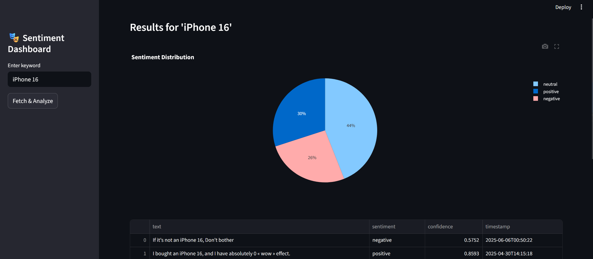

# Sentiment-Scope
A real-time sentiment analysis dashboard that monitors social media mentions and provides actionable insights through interactive visualizations. Built with HuggingFace Transformers, FastAPI, and Streamlit for scalable sentiment monitoring across multiple platforms.

## 📸 Demo Screenshot

🛠️ Tech Stack
Backend

Python 3.8+ - Core programming language
HuggingFace Transformers - Pre-trained NLP models
PRAW - Reddit API wrapper
SQLite/PostgreSQL - Data storage
Pandas - Data manipulation

Frontend

Streamlit - Interactive web dashboard
Plotly - Dynamic visualizations
WordCloud - Text visualization

ML Models

cardiffnlp/twitter-roberta-base-sentiment - Primary sentiment model
VADER Sentiment - Social media optimized analyzer
TextBlob - Baseline comparison model

Deployment

Streamlit Cloud - Free hosting
GitHub Actions - CI/CD pipeline
Docker - Containerization (optional)

1. Python Environment
# Create virtual environment
python -m venv sentiment-env
source sentiment-env/bin/activate  
# On Windows: sentiment-env\Scripts\activate

# Upgrade pip
pip install --upgrade pip

2. Install Dependencies
  pip install streamlit==1.28.0
  pip install transformers==4.34.0
  pip install torch==2.0.1
  pip install pandas==2.0.3
  pip install plotly==5.17.0
  pip install praw==7.7.1
  pip install python-dotenv==1.0.0
  pip install wordcloud==1.9.2
  pip install vaderSentiment==3.3.2
  pip install textblob==0.17.1
